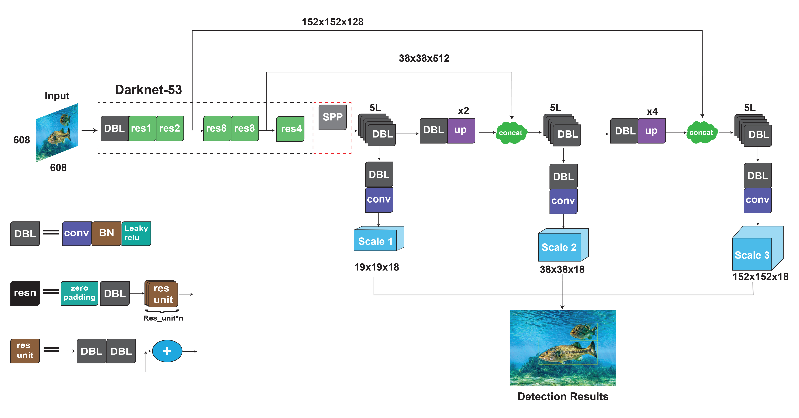
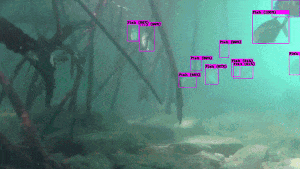
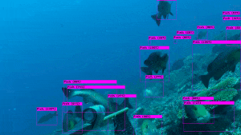

# YOLO-Fish
## A Robust Fish Detection Model to Detect Fish in Realistic Underwater Environment.
### Accepted At Ecological Informatics [[Paper]](https://www.sciencedirect.com/science/article/abs/pii/S1574954122002977)

 
 

# Dataset
Download the annotated DeepFish dataset from [here](https://drive.google.com/file/d/10Pr4lLeSGTfkjA40ReGSC8H3a9onfMZ0/view?usp=sharing)  
To download OzFish dataset, visit the [link](https://github.com/open-AIMS/ozfish)

# Working Procedure
This projects was implemented using darknet framework for detection model. To know the setup requirements, how to compile and train on different OS, how to use command line everything you will get by visiting [AlexeyAB/darknet](https://github.com/AlexeyAB/darknet) github repository.

# Evaluation Model

1. Download the test dataset and unzip.  
  [test dataset of deepfish](https://drive.google.com/file/d/1iHPFbqo-B2iVytusHic9s8VuMlLIMu5-/view?usp=sharing)  
  [test dataset of ozfish](https://drive.google.com/file/d/1C_7l2YFc5fXt1DMsuVZPDFKTJLm0syX3/view?usp=sharing)  
  [test dataset of merge dataset](https://drive.google.com/file/d/1abQbj2JhvRNIDNug3FcBzqYYwUEOchfZ/view?usp=sharing)
2. Download the cfg file of a chosen model.  
  [cfg of different models](https://github.com/tamim662/YOLO-Fish/tree/main/models) 
3. Download the Model's weights.(google-drive mirror)  
  [models trained on deepfish](https://drive.google.com/drive/folders/1fTnB09ly49ZaN0VoHN62300ATkWx3DWu?usp=sharing)  
  [models trained on ozfish](https://drive.google.com/drive/folders/1pHa0CqYFXaPJ9KrHHxWUsHyPaxWP9PDG?usp=sharing)  
  [models trained on merge dataset](https://drive.google.com/drive/folders/1BmBdxwGCH3IS0kTeDxK2hT8vVvEtd_3o?usp=sharing) 
4. Content of the file obj.data should be  
```
classes=1
train=data/train.txt
valid=data/test.txt
names=data/obj.names
backup=backup/
```
5. obj.names files should contain just a 'Fish' word.  
6. Keep wieghts files in a backup directory and cfg files in cfg directory.  
7. Run the command(linux) to evaluate map for a YOLO-Fish models.  
``` bash
./darknet detector map data/obj.data cfg/yolo-fish-2.cfg backup/merge_yolo-fish-2.weights  
```
## Run the command to test on video for real-time detection   
```bash
./darknet detector demo data/obj.data cfg/yolo-fish-2.cfg backup/merge_yolo-fish-2.weights input.mp4 -dont_show -ext_output -out_filename output.avi
```  
## For using network video-camera mjpeg-stream with any Android smartphone, check [here](https://github.com/AlexeyAB/darknet#for-using-network-video-camera-mjpeg-stream-with-any-android-smartphone)


  

 
